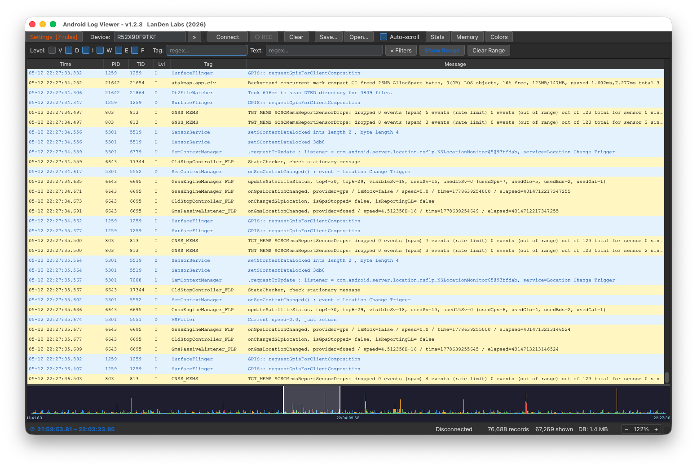
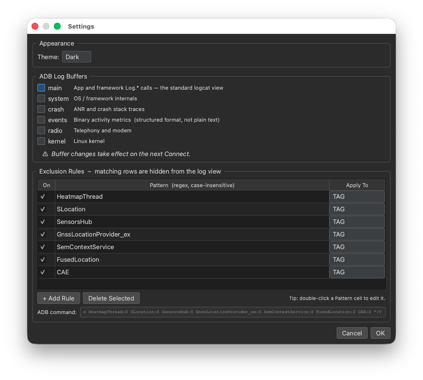
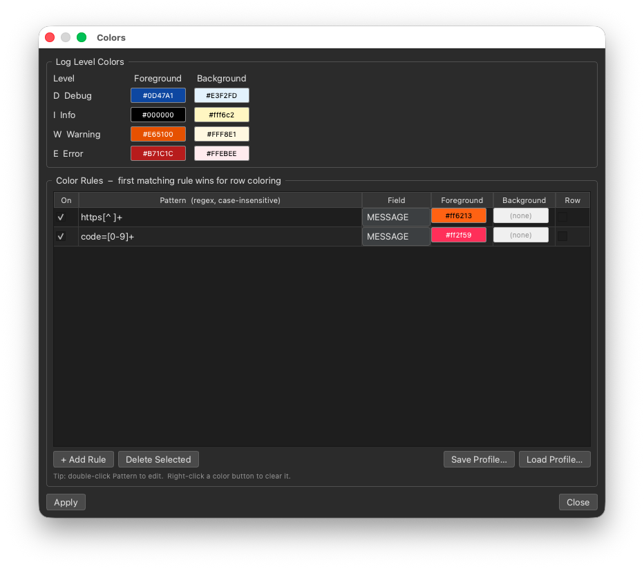
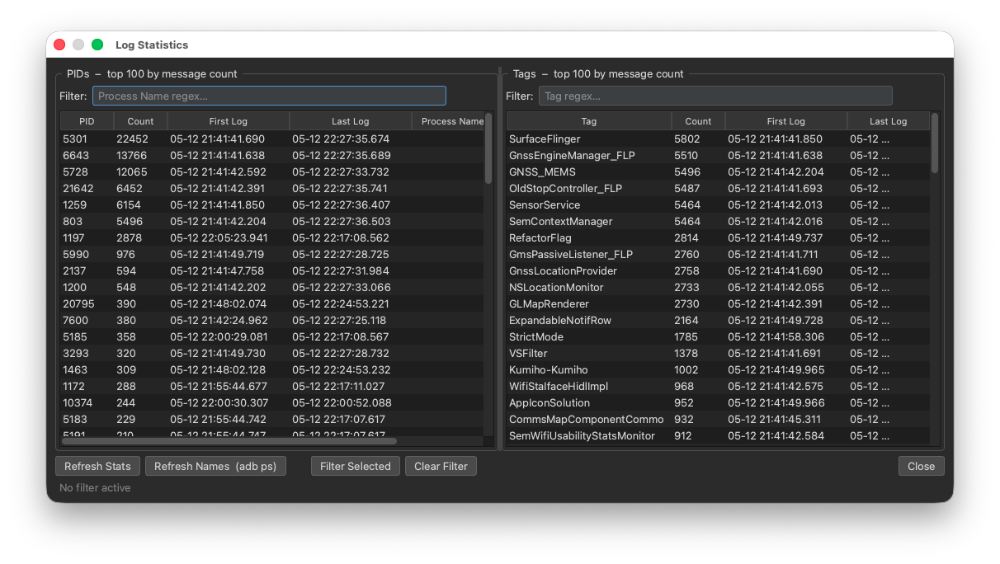
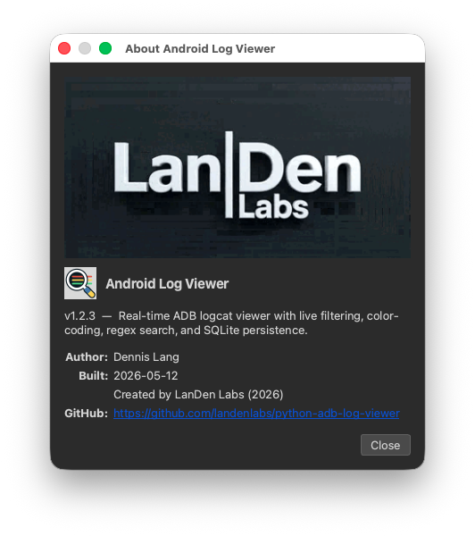

<table border="0">
  <tr>
    <td>
      <!-- VERSION -->v6.05.20<br>
      <!-- DATE -->20-May-2026<br>
      macOS &nbsp;|&nbsp; Windows &nbsp;|&nbsp; Linux<br>
      <a href="https://landenlabs.com">Home</a>
    </td>
    <td>
      <a href="https://landenlabs.com">
        
      </a>
    </td>
  </tr>
</table>

# Android Log Viewer


A fast, cross-platform **ADB logcat viewer** built with Python and PySide6. Stream live logs from any connected Android device, filter by level, tag, and text, color-code entries by pattern, and save sessions to a SQLite database for later review.

**By [LanDen Labs](https://github.com/landenlabs) (2026)**

---

## Screenshots

**Main window — live logcat stream with level and tag filtering**



**Settings — ADB buffer selection and exclusion rules**



**Colors — log level colors and pattern-based row highlighting**



**Stats — PID / tag statistics with one-click filter**



**About dialog**



---

## Features

- **Live logcat streaming** — connects to any ADB device or emulator and streams logs in real time
- **Level filtering** — toggle Verbose, Debug, Info, Warning, Error, and Fatal independently
- **Tag and text regex** — case-insensitive regex filters on tag and message columns simultaneously
- **Color coding** — configurable foreground/background colors per log level plus unlimited pattern-based rules
- **Exclusion rules** — silently drop rows matching PID, tag, or message patterns before they reach the table
- **SQLite persistence** — every session is recorded to a temporary SQLite database on disk to keep RAM usage low; save to `.db` for full-fidelity replay or `.txt` for plain text export
- **Open saved logs** — reload `.db` databases or import plain `.txt`/`.log` logcat files
- **Timeline widget** — graphical bar chart of log volume over time; click to jump, drag to select a time range
- **Time-range filter** — restrict the table to the selected timeline range in one click
- **Stats dialog** — sortable PID and tag frequency tables; click any row to apply it as a filter
- **Memory monitor** — live per-process RSS memory via `adb shell /proc`; snapshot baselines and track deltas
- **Multi-device support** — dropdown to select from all connected devices; refresh without restarting
- **Record toggle** — pause database recording while keeping the live view running
- **Auto-scroll** — follows the latest log entry; automatically disables when you scroll up manually
- **Font zoom** — Ctrl +/− to scale the log table font from 6 pt to 24 pt
- **ADB buffer selection** — choose which logcat buffers to monitor (main, system, crash, events, radio, kernel)
- **Animated About dialog** — company logo animation plays once on open
- **Cross-platform** — identical experience on macOS, Windows, and Linux

---

## Requirements

- Python 3.10 or later
- PySide6 6.4 or later
- [Android SDK Platform Tools](https://developer.android.com/tools/releases/platform-tools) (`adb` on your PATH)
- A connected Android device or running emulator (USB debugging enabled)

---

## Installation

### Run from source

```bash
git clone https://github.com/landenlabs/python-adb-log-viewer.git
cd python-adb-log-viewer
pip install -r requirements.txt
python3 main.py
```

Or as a module:

```bash
python3 -m android_log_viewer
```

### Build a standalone binary

**macOS**

```bash
./build.sh
# Output: dist/android-log-viewer
```

**Windows**

```bat
build.bat
:: Output: dist\android-log-viewer.exe
```

Both scripts use [PyInstaller](https://pyinstaller.org) and embed the correct icon and version metadata automatically.

---

## Usage

### Connecting to a device

1. Select a device from the **Device** dropdown (click **⟳** to refresh the list).
2. Click **Connect** — the button toggles to **Disconnect**.
3. Logs begin streaming immediately.

### Filtering

| Control | Behavior |
|---------|----------|
| Level checkboxes (V D I W E F) | Show/hide rows at that log level |
| **Tag** field | Case-insensitive regex matched against the tag column |
| **Text** field | Case-insensitive regex matched against the message column |
| **✕ Filters** | Clear all level, tag, and text filters at once |

### Saving and loading

| Button | Action |
|--------|--------|
| **Save…** | Save to `.db` (SQLite, full fidelity) or `.txt` (filtered visible rows) |
| **Open…** | Load a `.db` database or a `.txt`/`.log` plain logcat file |

### Toolbar reference

| Button | Description |
|--------|-------------|
| **Settings** | Configure ADB buffers and exclusion rules |
| **⟳** | Refresh the device list |
| **Connect / Disconnect** | Start or stop logcat streaming |
| **● REC** | Toggle database recording (red = recording, gray = view-only) |
| **Clear** | Clear the view and in-memory database; flushes the device buffer |
| **Save… / Open…** | Save or load a session |
| **Auto-scroll** | Keep the table scrolled to the latest entry |
| **Stats** | Open the PID / tag statistics dialog |
| **Memory** | Open the live memory monitor |
| **Colors** | Configure level and pattern-based row colors |
| **?** | Open the About dialog |

### Timeline

The timeline below the log table shows log volume over time as a bar chart.

| Interaction | Effect |
|-------------|--------|
| Single click | Jump the log table to that timestamp |
| Click and drag | Select a time range |
| **Show Range** | Filter the table to the selected range |
| **Clear Range** | Remove the range filter |

### Keyboard shortcuts

| Shortcut | Action |
|----------|--------|
| `Ctrl+S` | Save logs |
| `Ctrl+O` | Open a saved log file |
| `Ctrl+L` | Focus the Tag filter field |
| `Ctrl+F` | Focus the Text filter field |
| `Ctrl++` | Zoom in (increase font size) |
| `Ctrl+-` | Zoom out (decrease font size) |
| `Ctrl+0` | Reset zoom to 100 % |

---

## Dialogs

### Settings

Configure which ADB logcat buffers to monitor and define exclusion rules to silently drop unwanted rows.

| Buffer | Contents |
|--------|----------|
| `main` | App and framework `Log.*` calls — the standard logcat view |
| `system` | OS / framework internals |
| `crash` | ANR and crash stack traces |
| `events` | Binary activity metrics (structured format) |
| `radio` | Telephony and modem |
| `kernel` | Linux kernel messages |

Exclusion rules match against **PID**, **TAG**, or **MESSAGE** and are applied before rows reach the table or database.

### Colors

Assign foreground and background colors to each log level, and define any number of pattern-based rules that override colors based on a regex match on the tag or message.

### Stats

Displays sortable frequency tables for PIDs and tags seen in the current session. Click any row to apply it as a tag or PID filter in the main window.

### Memory Monitor

Polls `adb shell /proc/*/status` at a configurable interval (2 s – 30 s) and shows live RSS memory for every running process. Use **Grab** to snapshot a baseline and track per-process deltas over time.

---

## Settings file

App preferences are saved automatically to:

| Platform | Path |
|----------|------|
| macOS / Linux | `~/.config/android_log_viewer/settings.json` |
| Windows | `%APPDATA%\android_log_viewer\settings.json` |

---

## Project structure

```
python-adb-log-viewer/
├── android_log_viewer/
│   ├── about_dialog.py        # About dialog — animated logo, app metadata
│   ├── adb_reader.py          # Background thread: streams adb logcat
│   ├── app_settings.py        # Persistent settings (JSON)
│   ├── color_rules.py         # Pattern-based color rule model
│   ├── colors_dialog.py       # Color configuration dialog
│   ├── constants.py           # Log level names and constants
│   ├── database.py            # SQLite log database
│   ├── log_model.py           # Qt model and proxy filter for the log table
│   ├── log_record.py          # Log record data class
│   ├── main_window.py         # Main window and toolbar
│   ├── mem_dialog.py          # Live memory monitor dialog
│   ├── mem_reader.py          # Background thread: adb shell /proc RSS
│   ├── ps_reader.py           # Background thread: adb shell ps
│   ├── resources.py           # Bundled resource path resolver (PyInstaller-safe)
│   ├── settings_dialog.py     # Settings dialog (buffers, exclusion rules)
│   ├── stats.py               # PID / tag statistics tracker
│   ├── stats_dialog.py        # Statistics and filter dialog
│   ├── themes.py              # Qt stylesheet themes
│   ├── timeline_widget.py     # Timeline bar-chart widget
│   └── version.py             # Version string
├── screens/                   # Screenshot assets used in this README
├── main.py                    # Entry point
├── log-viewer.png             # App icon source (401 × 400)
├── log-viewer.icns            # macOS icon bundle
├── log-viewer.ico             # Windows icon (6 sizes: 16 – 256 px)
├── landen_labs_about_400.gif  # Animated logo shown in the About dialog
├── windows_version_info.py    # Windows version resource for PyInstaller
├── build.sh                   # macOS build script (PyInstaller)
├── build.bat                  # Windows build script (PyInstaller)
├── requirements.txt
└── README.md
```

---

## License

Apache 2.0 © [LanDen Labs](https://github.com/landenlabs) 2026
